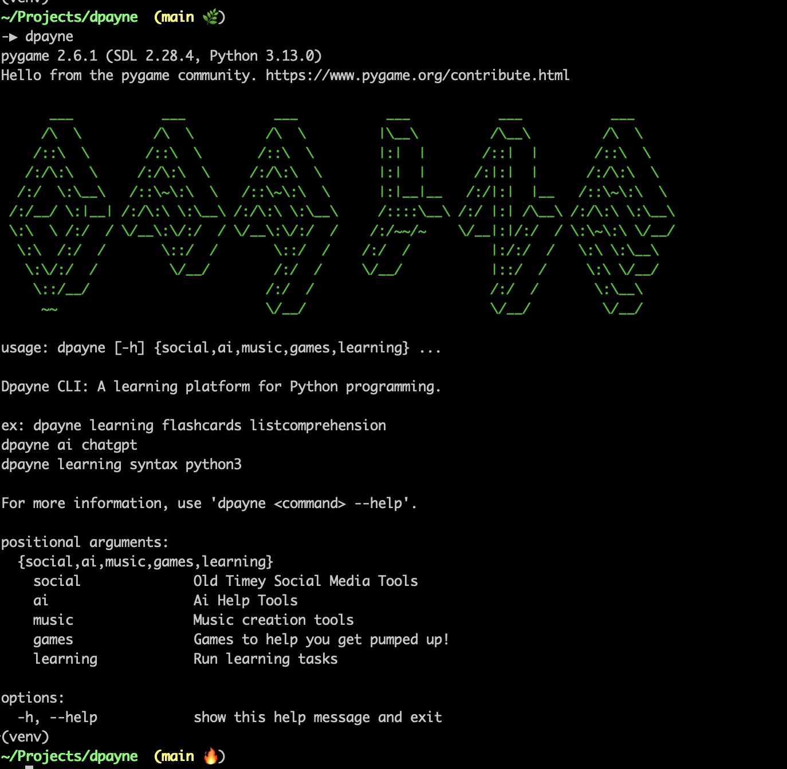

# Dpayne CLI

Dpayne CLI is a learning platform for Python programming syntax and concepts.



## Features

- Syntax correction exercises
- Modular learning tasks
- Basic AI chat integration
- Drum machine

## Installation

Install the CLI locally:
```bash
pip install .
```

## Usage

Run the CLI:
```bash
dpayne --help
```

Run the syntax lesson:
```bash
dpayne learning syntax python1
```
